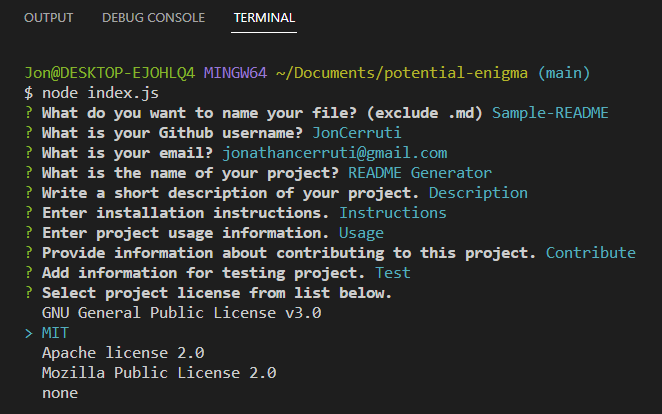
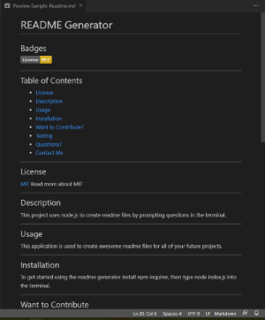
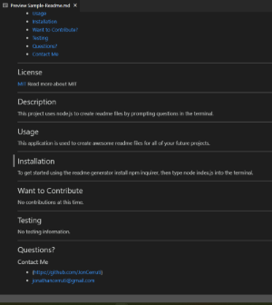

# README Generator
## Badges 

---

## Table of Contents
- [License](#license)
- [Description](#description)
- [Usage](#usage)
- [Example of project in use](#example-of-project-in-use)
- [Want to Contribute?](#want-to-contribute)
- [Questions?](#questions)
- [Contact Me](#contact-me)

---

## License
[MIT](https://opensource.org/licenses/MIT)
Read more about MIT

---

## Description
This project uses node.js to create professional readme files by prompting questions in the terminal. 

---

## Usage
This application is used to create awesome readme files for all of your future projects.

---

## Example of Project in Use

---

## Want to Contribute
No contributions at this time.

---

## Questions?
Please contact for questions!
### Contact Me
- (https://github.com/JonCerruti)
- jonathancerruti@gmail.com